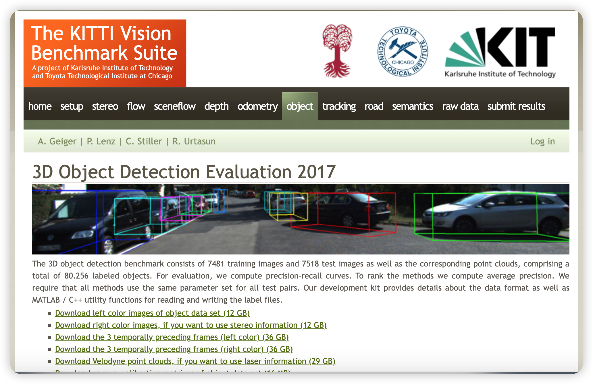
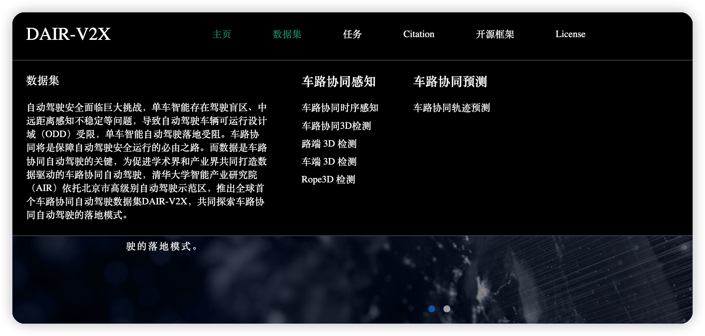

###  [KIT数据集](https://www.cvlibs.net/datasets/kitti/eval_object.php?obj_benchmark=3d)
这个数据集包含了大量的 camera/lidar 标注，当然也包含了3d标注


数据集的标注定义如下，详细的可以参考这个 [github 链接](https://github.com/bostondiditeam/kitti/blob/master/resources/devkit_object/readme.txt)

```

#Values    Name      Description
----------------------------------------------------------------------------
   1    type         Describes the type of object: 'Car', 'Van', 'Truck',
                     'Pedestrian', 'Person_sitting', 'Cyclist', 'Tram',
                     'Misc' or 'DontCare'
   1    truncated    Float from 0 (non-truncated) to 1 (truncated), where
                     truncated refers to the object leaving image boundaries
   1    occluded     Integer (0,1,2,3) indicating occlusion state:
                     0 = fully visible, 1 = partly occluded
                     2 = largely occluded, 3 = unknown
   1    alpha        Observation angle of object, ranging [-pi..pi]
   4    bbox         2D bounding box of object in the image (0-based index):
                     contains left, top, right, bottom pixel coordinates
   3    dimensions   3D object dimensions: height, width, length (in meters)
   3    location     3D object location x,y,z in camera coordinates (in meters)
   1    rotation_y   Rotation ry around Y-axis in camera coordinates [-pi..pi]
   1    score        Only for results: Float, indicating confidence in
                     detection, needed for p/r curves, higher is better.
```

其中的坐标转换关系，参考这个 [github 链接](https://github.com/bostondiditeam/kitti/blob/master/Papers_Summary/Geiger2013IJRR/readme.md)
#### 评测脚本
* 官方提供了[评测工具](TODO)

* 也有第三方的评测脚本[gihub 链接](https://github.com/traveller59/kitti-object-eval-python)
> Fast kitti object detection eval in python(finish eval in less than 10 second), support 2d/bev/3d/aos. , support coco-style AP. If you use command line interface, numba need some time to compile jit functions.


## [百度的 Rope3d](https://thudair.baai.ac.cn/rope)
百度的 DAIR  数据集包含了路端和车端的 3d 检测，含有 GPS/camera/Lidar的检测信息
>针对路侧视角下的3D感知任务的研究，我们开源了大规模、多视角下共计50009帧图像数据的Rope3D数据集。相比于DAIR-V2X，Rope3D数据集更加聚焦于纯视觉的单目3D感知任务




