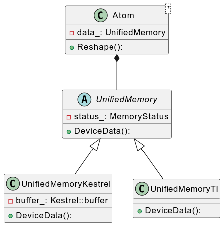

# 自动驾驶感知
## Roadmap
自动驾驶的感知算法模型到 SDK 部署之间的 pipline 关系
[first](./Roadmap/all.md)

## 相机感知
### mono3D 检测
### BEVFormer 多传感器融合检测

## 模型部署和推理
### Tensorrt
### Onnx

## Solution
- [相机抖动自动纠偏](./Solution/Camera-Pos-Auto-Fix/readme.md)
## SDK

